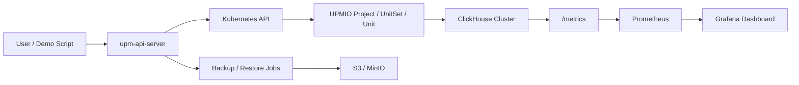

# UPMIO ClickHouse 运维管理 MVP

这是一个基于 UPMIO Operator 能力构建的 ClickHouse 运维管理软件原型，
用于黑客松第二阶段 Demo。

本项目已经完成一条可运行的 Kubernetes 原生运维链路：

- 通过 UPMIO `Project`、`UnitSet` 和包资产部署 ClickHouse。
- 通过 `upm-api-server` 暴露统一产品 API。
- 支持 2 shard x 2 replica ClickHouse + 3 Keeper 的运行时验证。
- 支持健康检查、Prometheus 指标汇总、Grafana Dashboard。
- 支持 Day2 只读诊断、即时备份、恢复、定时备份。
- 保留阶段 Spec、代码审阅、AI 使用证据、运行时验收脚本和结果文件。

`exam/` 目录包含比赛附件和评分材料，已明确排除在公开仓库之外。

## 架构概览



`upm-api-server` 是本项目的产品 API 入口。后续如果接入 MySQL、Redis
等其他数据库，也应继续注册到这个 API Server，而不是为每个数据库单独
实现一套本地命令。

## 仓库结构

| 路径 | 说明 |
|---|---|
| `api-server/` | `upm-api-server` 源码 |
| `clickhouse/phase-01..07/` | 阶段产物、运行时证据、Manifest、Values |
| `clickhouse/scripts/` | 统一后的安装辅助和验收脚本 |
| `clickhouse/grafana/` | ClickHouse Grafana Dashboard 资产 |
| `docs/api/` | API 完整参考 |
| `docs/manuals/` | 部署、API、脚本、Demo、阶段目标评估手册 |
| `docs/phases/` | 阶段 Spec |
| `docs/review/` | 阶段 Review 与修复记录 |
| `upm-packages/` | UPMIO 包源码子模块 |
| `unit-operator/` | UPMIO Unit Operator 源码子模块 |
| `compose-operator/` | UPMIO Compose Operator 源码子模块 |

## 快速开始

### 1. 克隆仓库

```bash
git clone --recurse-submodules <repo-url>
cd upm
```

如果已经克隆但没有拉取子模块：

```bash
git submodule update --init --recursive
```

### 2. 准备 Kubernetes 环境

本项目验证过的实验环境：

| 角色 | IP |
|---|---|
| Control plane | `192.168.35.201` |
| Worker | `192.168.35.202` |
| Worker | `192.168.35.203` |
| Worker | `192.168.35.204` |

需要具备：

- Kubernetes 集群。
- Helm。
- containerd。
- Calico 或等价 CNI。
- 默认 StorageClass，本项目使用 `local-path`。
- 本机可执行 `kubectl`、`helm`、`curl`、`jq`。

完整部署说明见
[`docs/manuals/deployment-manual.md`](docs/manuals/deployment-manual.md)。

### 3. 安装 UPMIO Operator 和 ClickHouse 包

安装 `unit-operator`：

```bash
helm upgrade --install unit-operator ./unit-operator/charts/unit-operator \
  -n upm-system --create-namespace \
  -f docs/runtime/manifests/unit-operator-install-values.yaml
```

安装 `compose-operator`：

```bash
helm upgrade --install compose-operator ./compose-operator/charts/compose-operator \
  -n upm-system --create-namespace \
  -f docs/runtime/manifests/compose-operator-install-values.yaml
```

安装 ClickHouse 包和 ClickHouse Keeper 包：

```bash
helm upgrade --install clickhouse-package \
  ./upm-packages/clickhouse/26.3.9.8/charts/clickhouse \
  -n upm-system --create-namespace \
  -f clickhouse/phase-02/values/runtime-2s2r-package-values.yaml

helm upgrade --install clickhouse-keeper-package \
  ./upm-packages/clickhouse-keeper/26.3.9.8/charts/clickhouse-keeper \
  -n upm-system --create-namespace
```

### 4. 同步运行时镜像

实验环境使用节点本地 containerd 镜像。请在仓库根目录执行：

```bash
SSH_PASSWORD=root clickhouse/scripts/sync-runtime-image-to-nodes.sh
SSH_PASSWORD=root clickhouse/scripts/sync-upm-api-server-image-to-nodes.sh
```

### 5. 部署 upm-api-server

```bash
kubectl apply -f clickhouse/phase-03/manifests/upm-api-server.yaml
kubectl -n upm-system rollout status deploy/upm-api-server --timeout=180s
```

验证 API Server：

```bash
curl -fsS http://192.168.35.201:30083/api/v1/healthz | jq .
```

预期：

```json
{
  "service": "upm-api-server",
  "status": "ok"
}
```

### 6. 安装监控环境

kube-prometheus-stack 是外部环境依赖，不属于 UPMIO 产品功能本身。

```bash
helm upgrade --install kube-prometheus-stack \
  prometheus-community/kube-prometheus-stack \
  -n monitoring --create-namespace
```

Grafana Dashboard 资产：

```text
clickhouse/grafana/upm-clickhouse-23285-dashboard.json
```

监控部署和校验说明见
[`docs/manuals/deployment-manual.md`](docs/manuals/deployment-manual.md)。

## API 使用

设置公共变量：

```bash
export UPM_API_SERVER_URL=http://192.168.35.201:30083
export NS=upm-clickhouse-phase03-runtime
export NAME=clickhouse-phase03
```

查看集群列表：

```bash
curl -fsS "${UPM_API_SERVER_URL}/api/v1/clusters" | jq .
```

运行健康检查：

```bash
curl -fsS -X POST \
  "${UPM_API_SERVER_URL}/api/v1/clusters/${NS}/${NAME}/healthcheck" | jq .
```

查看监控摘要：

```bash
curl -fsS \
  "${UPM_API_SERVER_URL}/api/v1/clusters/${NS}/${NAME}/metrics/summary" | jq .
```

查看 Day2 诊断：

```bash
curl -fsS \
  "${UPM_API_SERVER_URL}/api/v1/clusters/${NS}/${NAME}/diagnostics?limit=20" | jq .
```

备份、恢复和定时备份示例见
[`docs/manuals/api-manual.md`](docs/manuals/api-manual.md)。

完整 API 参考见
[`docs/api/upm-api-server-v1.md`](docs/api/upm-api-server-v1.md)。

## 运行验收

所有当前脚本已经集中到 `clickhouse/scripts/`。

推荐按以下顺序验证已完成的 MVP：

```bash
clickhouse/scripts/validate-phase03-upm-api-server-runtime.sh
clickhouse/scripts/validate-phase04-healthcheck-runtime.sh
clickhouse/scripts/validate-phase05-monitoring-runtime.sh
clickhouse/scripts/validate-phase06-diagnostics-runtime.sh
clickhouse/scripts/validate-phase07-backup-restore-runtime.sh
```

预期每个脚本最后输出对应的 `PASS ...`：

```text
PASS phase03_upm_api_server_runtime_validation
PASS phase04_healthcheck_runtime_validation
PASS phase05_monitoring_runtime_validation
PASS phase06_diagnostics_runtime_validation
PASS phase07_backup_restore_runtime_validation
```

脚本清单、参数和输出文件见
[`docs/manuals/scripts-manual.md`](docs/manuals/scripts-manual.md)。

## Demo 路径

推荐 Demo 顺序：

1. 展示 `upm-api-server` 已在 Kubernetes 内运行。
2. 展示 ClickHouse 由 UPMIO `UnitSet` 管理。
3. 运行健康检查。
4. 展示 Prometheus 指标和 Grafana Dashboard。
5. 运行 Day2 诊断。
6. 执行备份、恢复、定时备份验收。
7. 展示 AI 协作证据和阶段 Review 记录。

完整 Demo 讲解见
[`docs/manuals/demo-guide.md`](docs/manuals/demo-guide.md)。

## 黑客松第二阶段覆盖判断

当前仓库已经满足黑客松第二阶段 MVP 的核心目标：

- 有可运行的 ClickHouse 运维管理原型。
- 有核心代码和 API。
- 有真实 Kubernetes 环境部署路径。
- 有监控、诊断、备份、恢复、定时备份等关键功能。
- 有验收脚本和运行时证据。
- 有 AI 使用记录、Review 记录和修复记录。

详细评估见
[`docs/manuals/hackathon-stage2-assessment.md`](docs/manuals/hackathon-stage2-assessment.md)。

交付边界说明：

- 当前可验收工程交付范围是 Phase 01 到 Phase 07。
- Phase 08 到 Phase 12 是未来迭代规划，不是当前 MVP 未完成项。
- Demo 中只宣称已经通过真实 Kubernetes 验证的 Phase 01 到 Phase 07 能力。

详细说明见
[`docs/manuals/delivery-scope-statement.md`](docs/manuals/delivery-scope-statement.md)。

## 前端界面状态

当前 MVP 没有自定义前端界面。按比赛要求，API、核心代码、可运行 Demo
和文档已经可以支撑交付；但如果时间允许，建议增加一个很薄的 Web UI，
用于提升现场 Demo 表现和产品完整度。

建议前端只覆盖四个页面：

- 集群总览。
- 健康检查。
- Day2 诊断。
- 备份、恢复、定时备份。

前端应调用现有 `upm-api-server`，不要绕过 API 直接访问 Kubernetes 或
ClickHouse。

## 文档入口

| 文档 | 用途 |
|---|---|
| [`docs/manuals/deployment-manual.md`](docs/manuals/deployment-manual.md) | 环境部署手册 |
| [`docs/manuals/api-manual.md`](docs/manuals/api-manual.md) | API 使用手册 |
| [`docs/api/upm-api-server-v1.md`](docs/api/upm-api-server-v1.md) | API 完整参考 |
| [`docs/manuals/scripts-manual.md`](docs/manuals/scripts-manual.md) | 脚本使用手册 |
| [`docs/manuals/demo-guide.md`](docs/manuals/demo-guide.md) | 黑客松 Demo 手册 |
| [`docs/manuals/full-demo-runbook.md`](docs/manuals/full-demo-runbook.md) | 从 0 到完整 Demo 的操作手册 |
| [`docs/manuals/delivery-scope-statement.md`](docs/manuals/delivery-scope-statement.md) | 黑客松交付边界说明 |
| [`docs/manuals/hackathon-stage2-assessment.md`](docs/manuals/hackathon-stage2-assessment.md) | 第二阶段目标覆盖评估 |
| [`docs/master-spec.md`](docs/master-spec.md) | Master Spec |

## 质量检查

常用检查命令：

```bash
gitleaks detect --source . --redact
markdownlint "docs/**/*.md" "clickhouse/**/*.md" README.md api-server/README.md
go test ./...
```

阶段验收以实际命令输出、运行时证据、Review 结果和修复记录为准，不以
AI 自述作为完成依据。
